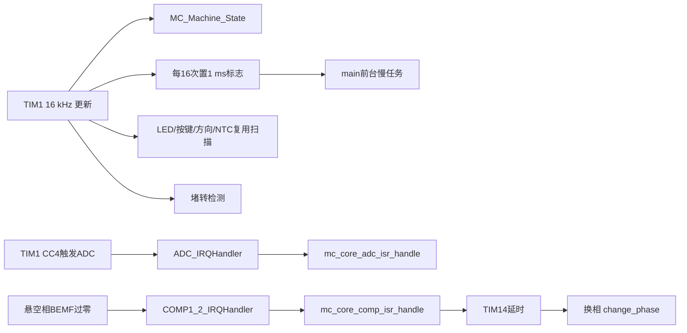
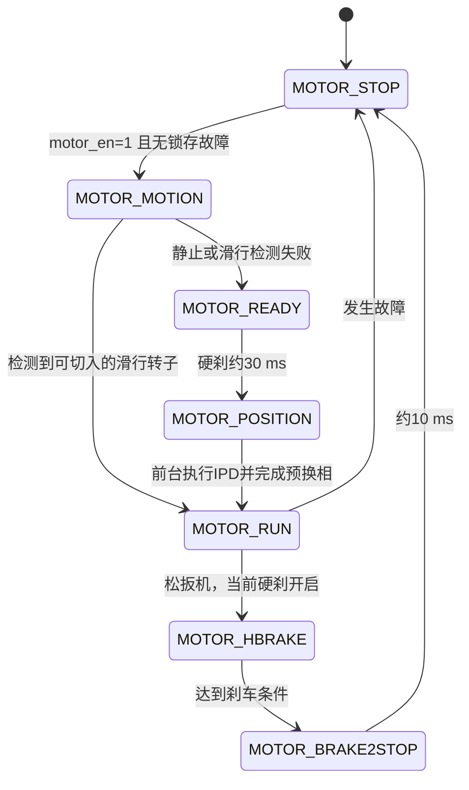

# 无刷电钻固件运行与阅读导引

> 本文是“外置注释”，用于在不修改 C/H 源码的前提下解释函数。当前工程目标为 MM32SPIN0230B1NV、60 MHz 系统时钟、16 kHz PWM，产品模式为电钻（`Wrench_EN=0`）。

## 1. 一句话理解架构

这是一个无 RTOS 的前后台系统：TIM1/ADC/比较器/TIM14 中断完成实时电机控制，`main()` 每 1 ms 处理扳机、方向、电压、电流、温度、用户状态和 LED。无感换相核心位于预编译库 `MC_CORE/002_mc_core_V1_01.lib`，源码通过 `mc_core.h` 中的数据和回调与它交互。



## 2. 先记住四组全局数据

| 对象 | 所在文件 | 作用 |
|---|---|---|
| `user_list` | `USER/user_control.c` | 扳机、方向、档位、测量值、用户状态和实时用户故障 |
| `motor_control_list` | `MOTOR_CONTROL/motor_control.c` | 电机外层状态、PWM目标、校准和刹车配置 |
| `mc_core_list` | 闭源库，声明于 `MC_CORE/mc_core.h` | ADC/BEMF实时数据、换相计时、当前PWM、电机使能和核心故障 |
| `machine_error_hold` | `USER/user_control.c` | 把用户故障和核心故障锁存，防止故障消失后带扳机自动重启 |

不要把 `user_list.user_state` 与 `motor_control_list.bldc_state` 混为一谈：前者决定“工具是否允许转”，后者决定“电机正处于检测、定位、运行还是刹车”。

## 3. 上电运行顺序

1. 启动汇编执行 `SystemInit()`，配置时钟并进入 C 运行库，随后调用 [`main()`](../USER/main.c#L86)。
2. `Systick_Init()`只提供阻塞式微秒延时，不负责 1 ms 调度。
3. `Bsp_Gpio_Init()`配置运放、比较器、ADC和三相PWM引脚。
4. [`Peripheral_Init()`](../USER/board.c#L594)依次初始化 ADC、比较器、运放、TIM1 PWM、TIM13/TIM14和无感BEMF比较器。
5. `user_para_init()`清用户状态；随后校准5 V参考、采样电流零偏、逐个检测六个MOS桥臂。
6. `read_user_data()`从Flash最后1 KiB页读取档位/自动停止设置；`mc_init()`把电机参数交给闭源核心。
7. 初始化使能脚和LED，最后执行 `Interrupt_Init()`。此后实时中断开始运行。
8. 上电再采样方向、电压和MOS温度，并锁存初始故障，然后进入无限循环。

`main()`中的 1 ms 任务固定顺序为：

```text
方向消抖 -> 电压保护 -> 扳机消抖 -> 电流保护 -> MOS温度
-> 计算PWM目标 -> 档位处理 -> 用户状态机 -> 锁存故障
-> LED显示 -> 同步motor_en -> 必要时执行IPD
```

## 4. 实时中断顺序

| 执行域 | 频率/触发 | 主要工作 |
|---|---|---|
| TIM1更新中断 | 每62.5 us（16 kHz） | 电机状态机、1 ms分频、LED复用扫描、堵转检测 |
| ADC EOS中断 | TIM1 CC4同步触发 | 读取三相BEMF、电流、扳机、母线电压等；瞬时过流关PWM；进入核心ADC处理 |
| COMP2中断 | 悬空相过零事件 | 通知核心记录过零并安排换相 |
| TIM14中断 | 过零后的定时事件 | 核心执行延时换相并选择下一悬空相 |
| main前台 | TIM1每16次置标志 | 每1 ms运行用户控制和慢保护 |

TIM1、ADC和比较器路径中禁止加入阻塞延时、Flash写入或大循环；它们直接决定换相时序和保护响应。

## 5. 按下扳机后的真实状态流程

扳机使用VR ADC：连续约11 ms高于300判定按下，连续约11 ms低于200判定松开。VR的600到4000被线性映射到约15%到100%占空比。



代码中还保留 `Motor_Align -> MotorStart_Drag_OPENLOOP -> MOTOR_RUN`，但当前从 `MOTOR_STOP` 进入该路径的语句已注释，它不是本配置的正常启动路线。

## 6. 五个最容易读错的地方

### 6.1 PWM不是一个目标值

```text
u16VR
  -> pwm_duty_aim_per       原始线性目标
  -> pwm_duty_aim           档位/产品逻辑后的目标（当前等于前者）
  -> pwm_duty_virtual       第一级慢斜坡
  -> pwm_actual_runing_data 第二级斜坡/可选限流
  -> PwmDutyUpdate()        写TIM1 CCR1/2/3
```

当前 `LIMIT_SPEED_EN`、峰值限流和平均值限流均关闭，但过流“故障停机”仍开启。不要把“限流未开启”理解成“过流保护未开启”。

### 6.2 故障是锁存的

`user_list.userErr` 和 `mc_core_list.MC_error` 是实时故障；`error_hold_updata()`使用按位或写入 `machine_error_hold`。故障恢复通常要求松开扳机，实时故障已消失，并满足瞬时过流/堵转的专门清除条件。

### 6.3 LED扫描也是采样时序

有效的 [`LED_Scan()`](../USER/led.c#L307)有12个槽位：1到6驱动LED，7到11切换共享引脚并打开NTC采样窗口，12读取 `Key_Data` 和 `Dir_Data`。方向或温度异常时，应同时检查引脚模式、`led_scan_index` 和 `led_reuse_adc_flag`。

### 6.4 计数器单位取决于调用域

`MC_Machine_State()`和`motor_block_detect()`在16 kHz域运行；其中“1 ms”参数常乘 `SLOWLOOP_1ms_CNT_LOAD=16`。`user_control.c`中的保护计数通常在1 ms域运行，直接以毫秒计数。先确认函数由谁调用，再解释常数。

### 6.5 核心算法没有源码

`motion_handle()`、`ipd_detect()`、`mc_core_adc_isr_handle()`、`mc_core_comp_isr_handle()`和`mc_core_timer14_isr_handle()`来自 `.lib`。阅读重点应放在传入参数、调用时机、调用前后 `mc_core_list` 的变化，而不是在仓库中寻找不存在的实现。

## 7. 关键函数的外置函数头注释

下面的注释块可直接放在脑中对应到函数开头；本文不写回源码。

```c
/* main(): 完成一次性硬件/安全初始化；随后只在TIM1产生的1 ms标志下
 * 运行用户慢任务。实时换相不在while(1)中完成。 */

/* TIM1_BRK_UP_TRG_COM_IRQHandler(): 16 kHz系统心跳。
 * 每个PWM周期推进电机状态机和堵转计数，并分频产生1 ms前台任务。 */

/* ADC_IRQHandler(): PWM同步采样入口。
 * 先更新共享ADC数据，立即判断严重峰值过流，再把采样交给无感核心。 */

/* MC_Machine_State(): 16 kHz电机外层状态机。
 * 只管理启动方式、运行、刹车和停止；具体IPD/过零/换相由核心库处理。 */

/* user_state_control(): 1 ms工具权限状态机。
 * 根据扳机与锁存故障产生gToolEn；它不直接驱动三相桥。 */

/* pwm_set(): 把用户目标经过两级斜坡和可选限流变为硬件占空比。
 * 修改前必须分清aim、virtual和actual三个层级。 */

/* error_hold_updata(): 故障锁存点。
 * 使用OR而非普通赋值，因此实时故障位恢复不代表锁存故障立即恢复。 */

/* LED_Scan(): LED与按键/方向/NTC共用引脚的12槽扫描器。
 * 任何槽位调整都会同时影响显示和采样，不是单纯UI函数。 */
```

其他关键函数可按下表理解：

| 函数 | 阅读时放在函数头的解释 |
|---|---|
| `mc_init()` | 把宏配置转换为核心库参数，并清空电机运行上下文 |
| `CurrentOffsetCalibration()` | 停PWM并临时改ADC为软件触发，平均16次电流零偏后恢复ADC |
| `mose_check()` | 上电逐个激励六个MOS，利用异常电流判断桥臂短路 |
| `motor_on_off_control()` | 只做扳机阈值迟滞和约11 ms消抖 |
| `user_direction_handle()` | 方向消抖；只允许在停止/刹车阶段更新核心方向 |
| `pwm_duty_aim_deal()` | 把VR映射成15%到100%的原始占空比目标 |
| `user_oc_handle()` | 1 ms平均/峰值多级过流累计与恢复 |
| `Volt_Handler()` | 计算母线电压并对待机欠压、运行欠压、严重欠压和过压消抖 |
| `User_Temperature_Handler()` | MOS NTC过温检测，带动作/恢复阈值和时间迟滞 |
| `motor_block_detect()` | 16 kHz堵转累计；同时使用运行时间和四档峰值电流条件 |
| `Stop_Motor()` | CCR清零并关闭六路互补输出，桥臂不驱动 |
| `Brake_Motor()` | 使能低侧制动组合，与自然停机不同 |

## 8. 最快阅读顺序

1. 先看 [`parameter.h`](../USER/inc/parameter.h) 和 [`motor_config.h`](../MOTOR_CONTROL/motor_config.h)，只标记当前为1的功能宏和所有时间/电流/电压阈值。
2. 看 [`user_control.h`](../USER/inc/user_control.h)、[`motor_control.h`](../MOTOR_CONTROL/motor_control.h)、[`mc_core.h`](../MC_CORE/mc_core.h)，掌握四组全局数据和两个状态枚举。
3. 看 [`main.c`](../USER/main.c#L86)，先读初始化顺序，再逐行读1 ms任务顺序。
4. 看 [`board.c`](../USER/board.c#L277) 的ADC通道表和 `Peripheral_Init()`，建立“哪个物理量来自哪个外设”的映射。
5. 看 [`mm32_it.c`](../USER/mm32_it.c#L387)，按 ADC -> TIM1 -> TIM14 -> COMP 的顺序读四个有效中断。
6. 看 [`user_control.c`](../USER/user_control.c#L632)，按保护函数 -> 方向/扳机 -> PWM目标 -> `user_state_control()` 阅读。跳过1到1200行中被 `#if 0` 包住的旧版本。
7. 看 [`motor_control.c`](../MOTOR_CONTROL/motor_control.c#L769) 的状态机，再回看 `pwm_set()`、堵转、校准和MOS检测。
8. 看 [`drv_pwm.c`](../DRIVE/drv_pwm.c#L138)，理解六步相位组合、停止、硬刹和CCR更新。
9. 最后看 [`led.c`](../USER/led.c#L307) 与 [`flash_data_save.c`](../USER/flash_data_save.c#L38)。只有排查寄存器问题时才深入 `MM32SPIN0230/HAL_Lib` 和 `CMSIS`。

不要阅读 `USER/user_function.c`：它未加入当前Keil工程且与 `user_control.c` 有重复函数。第一遍也应跳过所有 `#if 0` 分支和 `LIMIT_SPEED_EN`/`Wrench_EN`关闭的功能。

## 9. 上板调试的断点与观察顺序

1. 首次仅在限流电源、空载或安全夹具下测试；确认相线、方向和电压等级。
2. 在 `main()`执行完 `Interrupt_Init()`后停一次，检查 `CurrentOffset_ad_data`、两个错误字和母线电压。
3. 观察 `user_list.flag.bits.gToolTrigger`、`user_state`、`gToolEn`、`mc_core_list.motor_en`，确认用户使能链。
4. 记录 `motor_control_list.bldc_state`，应看到 `STOP -> MOTION -> READY -> POSITION -> RUN`，滑行热启动时可由 `MOTION`直接到`RUN`。
5. 运行中观察 `bldc_step_current`、`bldc_bemf_detected`、`time_count_60_degree`和三层PWM变量。
6. 故障时同时看 `userErr.word`、`MC_error.word`及两个 `*_hold.word`，从首次置位的位反推来源。

不要在电机带电运行时长时间单步 ADC、TIM1、COMP 或 TIM14 中断；停在实时中断中会破坏换相时序，可能触发大电流。优先使用条件断点、观察窗口、Event Recorder或示波器调试脚。
